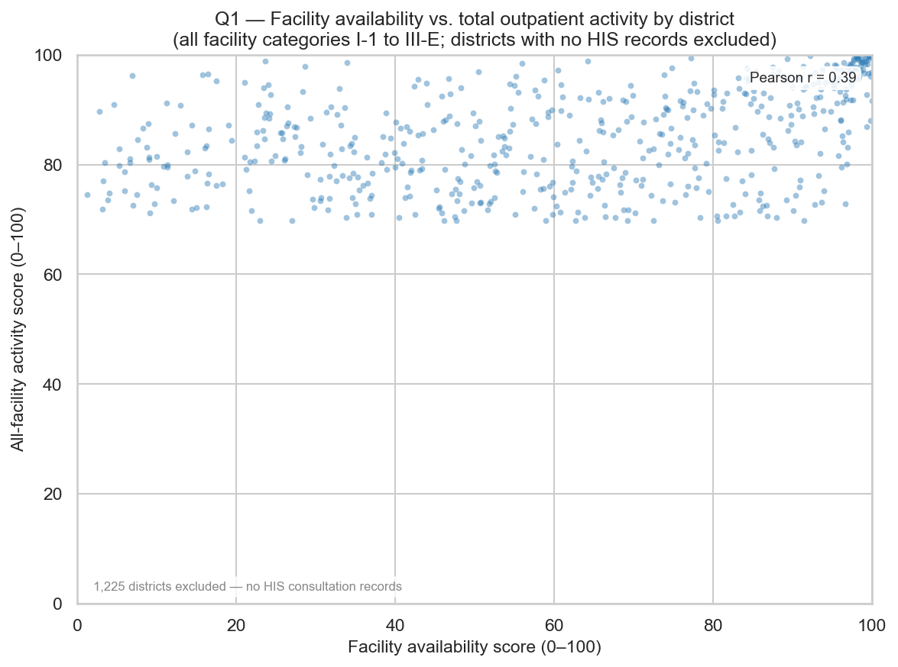
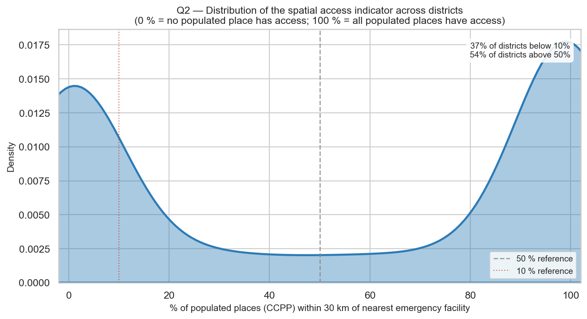
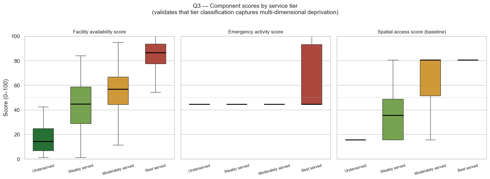
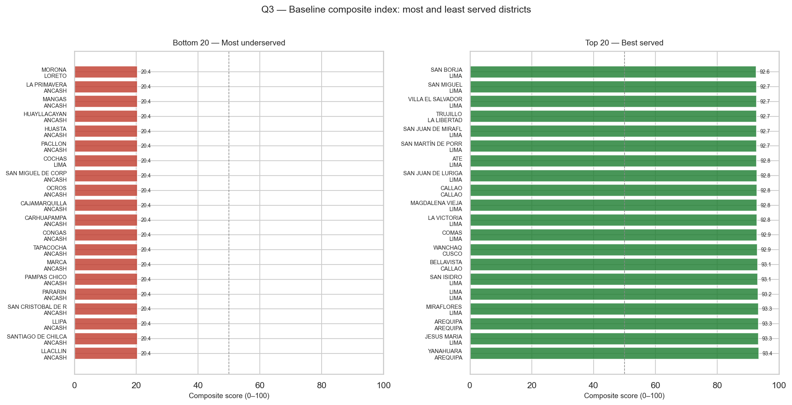
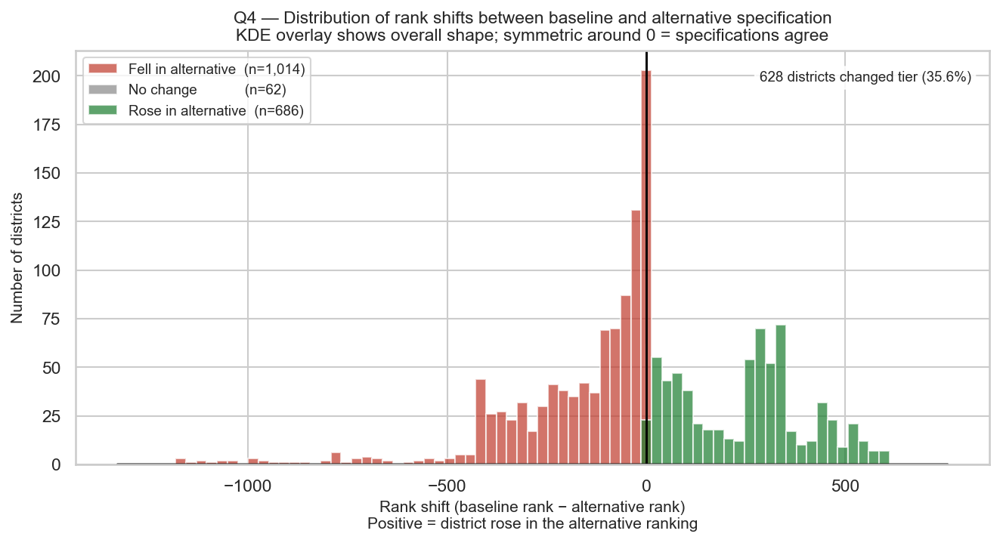

# Emergency Healthcare Access in Peru — Geospatial Analytics Pipeline

## What does the project do?

This project builds a district-level geospatial analytics pipeline that measures inequality in emergency healthcare access across Peru's 1,762 districts. It ingests four public health and geographic datasets, cleans and integrates them, computes spatial distances between populated settlements and health facilities, and produces a composite access index with two competing specifications. Results are delivered as static choropleth maps, statistical charts, and an interactive Streamlit dashboard.

---

## Main Analytical Goal

The central question is: **which districts are structurally underserved in emergency healthcare, and how sensitive is that classification to the choice of access standard?**

The analysis quantifies three dimensions of access:
1. **Facility availability** — how many active facilities exist per km² of district territory
2. **Emergency activity** — actual outpatient consultation volume at hospital-grade facilities
3. **Spatial access** — what share of populated places lie within a clinically meaningful distance of the nearest emergency-level facility

These dimensions are combined into a composite index and compared across two specifications (baseline vs. alternative) to test how robust district rankings are to the definition of "access."

---

## Datasets Used

| Dataset | Source | Description | Raw rows |
|---|---|---|---|
| **IPRESS** | SUSALUD | National registry of health facilities (all categories I-1 to III-E, coordinates, institution, status) | 20,819 |
| **ConsultaC1** | MINSA HIS | Aggregated outpatient consultations by facility, district, sex, and age group (2025) | 342,753 |
| **DISTRITOS** | IGN / INEI | District polygon shapefile covering all of Peru | 1,873 polygons |
| **CCPP** | IGN / INEI | Populated-place point layer at 1:100,000 scale (~136 K settlements) | 136,587 |

All raw files are stored unmodified in `data/raw/`.

---

## Data Cleaning

Cleaning is implemented in `src/cleaning.py` and run via `python -m src.cleaning`.

### IPRESS
- Renamed `NORTE → longitud` and `ESTE → latitud` (column labels are swapped in the source file — NORTE stores longitude, ESTE stores latitude).
- Zero-padded UBIGEO from integer to 6-character string to preserve leading zeros (e.g., `60101 → "060101"`).
- Dropped 14 exact duplicate rows and 12 additional records with duplicate `codigo_unico` values.
- Removed 2 records with coordinates outside Peru's bounding box (lat −18.5 to 0, lon −82 to −68).
- **Cleaned output:** `data/processed/ipress_clean.csv` (20,793 rows); `data/processed/ipress_geo.gpkg` (7,946 rows with valid coordinates).

### ConsultaC1
- Parsed with semicolon delimiter and latin-1 encoding (default comma delimiter causes a parse error).
- Dropped 19,458 exact duplicate rows.
- Dropped 41,241 rows where sex, age group, and all count columns are simultaneously NE-coded (no analytical value).
- Mapped sex codes to M / F / null; converted count columns to nullable integer (`Int64`).
- **Cleaned output:** `data/processed/consulta_clean.csv` (282,054 rows).

### CCPP
- Regenerated missing `.shx` companion file via `SHAPE_RESTORE_SHX=YES`.
- Derived 6-digit UBIGEO from the locality `CÓDIGO` where present (72,388 rows have no code; retained with `ubigeo = null` because their geometry is valid and useful for spatial joins).
- Filtered to Peru bounding box on geometry coordinates.
- **Cleaned output:** `data/processed/ccpp_clean.gpkg` (136,587 rows).

### DISTRITOS
- Source shapefile is missing its `.dbf` (no attribute data) — only polygon geometry is recoverable.
- Assigned `CRS = EPSG:4326` based on coordinate range inspection.
- Recovered UBIGEO codes by spatially joining CCPP points (which carry 6-digit locality codes) to district polygons and taking the mode code per polygon. Coverage: 1,803 of 1,873 polygons.
- Dissolved multipart polygons: 1,873 rows → 1,832 rows (districts with disconnected territories — exclaves, river islands — are unioned into a single (Multi)Polygon geometry per UBIGEO).
- **Cleaned output:** `data/processed/distritos_clean.gpkg` (1,832 rows).

---

## Data Dictionary

Full variable-level documentation is in [`output/tables/data_dictionary.md`](output/tables/data_dictionary.md). Below is a brief summary of each dataset's key columns.

| Dataset | Key columns |
|---|---|
| **IPRESS** (`ipress_clean.csv`) | `codigo_unico` — facility ID; `categoria` — level I-1 to III-E; `condicion` — operational status (EN FUNCIONAMIENTO, INOPERATIVO, etc.); `longitud` / `latitud` — WGS-84 coordinates; `ubigeo` — 6-digit district code |
| **ConsultaC1** (`consulta_clean.csv`) | `ubigeo` — district; `categoria` — facility level; `sexo` — M/F; `grupo_etario` — age group (1–15); `total_atenciones` — outpatient encounters; `total_atendidos` — distinct patients |
| **CCPP** (`ccpp_clean.gpkg`) | `nombre_poblado` — place name; `ubigeo` — district code (null for ~72 K uncoded places); `geometry` — WGS-84 point |
| **DISTRITOS** (`distritos_clean.gpkg`) | `ubigeo` — district code (recovered via spatial join); `distrito` / `provincia` / `departamento` — administrative names; `geometry` — WGS-84 polygon |
| **distritos_geo** (`distritos_geo.csv`) | `n_active` / `n_emergency` — facility counts; `area_km2` — district area; `dist_km_nearest_emergency` / `dist_km_nearest_any` — straight-line km to nearest facility |
| **district_scores_baseline/alternative** | `fac_score` / `activity_score` / `access_score` — component percentile ranks (0–100); `composite_score` — weighted index; `tier` — service tier; `pct_ccpp_within_30km_emerg` / `pct_ccpp_within_15km_any` — raw spatial access indicators |

---

## District-Level Metrics

Metrics are built in `src/metrics.py` and run via `python -m src.metrics`.

### Composite Access Index

Each district receives a score on three components. Every component is converted to a percentile rank (0–100, higher = better served) before weighting, so all three are on the same scale regardless of original units.

**Component 1 — Facility availability**

- **Indicator:** active-facility density = number of facilities with status `EN FUNCIONAMIENTO` ÷ district area in km².
- **Why density, not raw count:** a raw count rewards large districts. Loreto has more facilities than Miraflores, but its facilities are spread across 368,000 km². Dividing by area makes the measure comparable across districts of very different sizes.
- **Why active facilities only:** facilities coded `INOPERATIVO`, `CIERRE TEMPORAL`, or `RESTRICCIÓN DE SERVICIOS` are not available to patients and should not inflate a district's score.

**Component 2 — Emergency activity**

- **Indicator:** total outpatient consultations recorded at emergency-level facilities (categories II-1, II-2, II-E, III-1, III-2, III-E) in the MINSA HIS 2025 dataset.
- **Why emergency-level only:** primary-care facilities (I-1 to I-4) do not have emergency departments. Restricting to level II and III facilities ensures the indicator measures actual emergency-care utilisation, not routine primary visits.
- **Why consultation volume:** facility counts measure supply; consultation volume measures whether that supply is actually used. A district can have a hospital on paper but report zero emergency consultations — this component penalises that. Districts with zero emergency-level consultations receive the minimum percentile rank.
- **Important caveat:** ConsultaC1 only covers facilities that submit reports to HIS. 1,225 of 1,762 districts have no HIS records at all — their facilities either do not report or are exclusively private. These districts all share the same tied rank in this component.

**Component 3 — Spatial access**

- **Indicator:** percentage of CCPP populated places within a distance threshold of the nearest relevant facility (30 km for the baseline specification; 15 km for the alternative).
- **Why a percentage share, not mean distance:** a district mean distance is dominated by one or two extremely remote villages that inflate the average for the whole district. The share within a clinically meaningful threshold directly answers: "how many of this district's communities have actionable geographic access to care?" — which is what policy intervention targets.
- **Why 30 km (baseline):** a commonly cited threshold in rural health access studies as the outer bound of a reasonable emergency transport journey by road or river; beyond this distance, outcomes for time-sensitive conditions (trauma, obstetric emergencies) deteriorate sharply.
- **Why straight-line (Euclidean) distance:** road-network routing requires data not available for all of Peru at this resolution. Euclidean distances underestimate actual travel times, especially in Amazonian and Andean areas — this is acknowledged as a limitation.

### Composite Score Formula

```
score_i = Σ ( w_c / Σ(w) × pct_rank(X_c,i) )    c ∈ {fac, activity, access}
```

### Two Specifications

| | Baseline | Alternative |
|---|---|---|
| Component weights | 1/3 · 1/3 · 1/3 | 0.25 · 0.25 · 0.50 |
| Distance threshold | 30 km | 15 km |
| Facility type | Emergency-level (II-1 to III-E) | Any registered facility |

The alternative doubles the spatial access weight, tightens the distance threshold, and relaxes the facility-type bar. Comparing both specifications tests whether district rankings are robust to the access definition.

### Service Tiers

Tiers are assigned by quartile of the composite score (applied independently per specification):

| Tier | Score range |
|---|---|
| Best served | ≥ 75th percentile |
| Moderately served | 50th–75th percentile |
| Weakly served | 25th–50th percentile |
| Underserved | < 25th percentile |

### CRS Strategy

All spatial data is **stored** in **EPSG:4326** (WGS-84 geographic, degrees). Distance and area computations are performed in **EPSG:32718** (WGS-84 / UTM Zone 18S, metres) and results are written back in EPSG:4326. UTM Zone 18S minimises linear distortion for Peru's most densely populated regions (Pacific coast and central Andes), which span the zone's centre.

---

## Installation

```bash
# Create and activate environment (Python 3.11 recommended)
conda create -n emergency_peru python=3.11
conda activate emergency_peru

# Install all dependencies
pip install -r requirements.txt
```

Key packages: `geopandas`, `pandas`, `numpy`, `matplotlib`, `seaborn`, `folium`, `branca`, `streamlit`.

---

## Running the Processing Pipeline

Each pipeline step lives in its `src/` module and is invoked with `-m` from the project root. Run them in order — each step depends on the outputs of the previous one.

```bash
# Step 1 — Data ingestion and cleaning
python -m src.cleaning
# Outputs: data/processed/ipress_clean.csv, ipress_geo.gpkg,
#          consulta_clean.csv, ccpp_clean.gpkg, distritos_clean.gpkg

# Step 2 — Geospatial pipeline (spatial joins, distances)
python -m src.geospatial
# Outputs: data/processed/distritos_geo.gpkg, distritos_geo.csv,
#          ipress_districts.gpkg, ccpp_districts.gpkg, ccpp_with_distances.gpkg

# Step 3 — Composite index and statistical figures
python -m src.metrics
# Outputs: output/tables/district_scores_baseline.csv,
#          district_scores_alternative.csv, specification_comparison.csv
#          output/figures/ (13 statistical charts)

# Step 4 — Geospatial and interactive maps
python -m src.mapping
# Outputs: output/figures/ (4 static maps + 3 interactive HTML maps)
```

---

## Statistical Charts

### Q1 — Facility Availability vs. Total Outpatient Activity



Each point is one district. The x-axis is the percentile rank of active-facility density (Component 1); the y-axis is the percentile rank of total outpatient consultations across all facility categories, I-1 to III-E. All categories are used here — not just emergency level — so that the 89% of districts with zero emergency hospitals still receive a distinct activity score. Only the 537 districts with at least one HIS record are plotted; the remaining 1,225 have no ConsultaC1 presence and would all collapse onto the same tied rank. The scatter was chosen because it simultaneously shows whether supply and utilisation co-vary (Pearson r in the corner) and flags outliers: districts above the trend have high volume relative to their infrastructure; districts below have infrastructure that is underused.

---

### Q2 — Distribution of Spatial Access Across Districts



The KDE shows how the spatial access indicator — percentage of CCPP populated places within 30 km of the nearest emergency facility — is distributed across all 1,762 districts. A KDE was chosen over a histogram because the smooth density curve makes the bimodal structure immediately visible: a large mass of districts near 0% (no populated place within reach of emergency care) and a second peak near 100% (near-complete local coverage), with few districts in between. This shape reveals that the access deficit is not gradual — districts are either largely covered or almost entirely without access, with little middle ground.

---

### Q3 — Component Scores by Service Tier



Three-panel box plots showing how each component score distributes within each service tier. This chart validates that the tier classification reflects genuine multi-dimensional deprivation, not a single indicator. A well-behaved index should show consistently increasing medians from Underserved to Best served across all three panels. Facility availability shows the sharpest separation; emergency activity separation is weaker because most districts — even moderately served ones — have zero emergency-level HIS consultations. The 20 most underserved and 20 best-served districts by composite score are shown below. The bottom 20 are concentrated almost entirely in Loreto and high-Andean departments (Apurímac, Huancavelica, Puno); the top 20 are in Lima, Callao, Arequipa, and the northern Pacific coast.



---

### Q4 — Rank Shift Between Specifications



Histogram of the per-district rank shift when moving from the baseline to the alternative specification (positive = district rose in the ranking). The chart was chosen because it shows both the magnitude and the direction of individual-district changes for all 1,762 districts at once. An approximately symmetric distribution centred on 0 would mean neither specification systematically advantages a type of district. The KDE overlay shows the overall shape. Together with the Spearman ρ = 0.857 reported in the findings, this chart answers whether high overall rank correlation hides systematic winners and losers — districts with dense primary-care networks but few emergency hospitals tend to rise, while large rural areas where even primary care is sparse tend to fall.

---

## Running the Streamlit App

After completing all four pipeline steps, launch the dashboard from the project root:

```bash
streamlit run app.py
```

The app opens in your browser at `http://localhost:8501` and contains four tabs:

| Tab | Contents |
|---|---|
| **Data & Methodology** | Problem statement, data sources, cleaning decisions, index design, CRS strategy, limitations |
| **Static Analysis** | Statistical charts (Q1–Q4) with interpretations and visual-design rationale |
| **GeoSpatial Results** | Static choropleth maps, analytical multi-layer maps, filterable district-level table, tier summary |
| **Interactive Exploration** | Three interactive Folium maps, district comparison tool (select districts to compare metrics side by side), specification sensitivity explorer with filterable table and top-movers list |

---

## Main Findings

| Question | Finding |
|---|---|
| **Facility coverage** | 1,574 of 1,762 districts (89.3%) have zero emergency-level facilities within their administrative boundaries. The 268 geolocated emergency facilities concentrate heavily along the Pacific coast and Lima metro area. |
| **Spatial access** | 74,577 of 136,587 populated places (54.6%) are more than 30 km from the nearest emergency facility (straight-line distance). 23,546 (17.2%) are more than 60 km away. The most remote district — Torres Causana, Loreto — is 316 km from the nearest emergency facility. |
| **Geographic inequality** | The most underserved districts concentrate in Loreto, Ucayali, Madre de Dios, Puno, Apurímac, and Huancavelica. Best-served districts are Lima metro, Arequipa, Trujillo, and the northern coast — reflecting decades of infrastructure investment concentrated in urban coastal areas. |
| **Specification sensitivity** | Spearman rank correlation between baseline and alternative composite scores is high (ρ > 0.85), but 628 of 1,762 districts (35.6%) change service tier. Tier changes concentrate at specification boundaries: districts near the 25th, 50th, and 75th percentile cutoffs are structurally near a boundary under both definitions and are therefore most sensitive to which access standard is applied. |

---

## Limitations

- **Euclidean distances only.** Straight-line distances in EPSG:32718 underestimate actual travel times, particularly in high-Andean and Amazonian districts where road topology diverges sharply from a straight line.
- **61.8% of IPRESS facilities lack GPS coordinates.** The spatial access component is based on the 38.2% that are georeferenced. If missing coordinates are systematically associated with smaller or more remote facilities, the analysis underestimates access deficits.
- **192 geolocated facilities fall outside all district polygons.** These retain their administrative UBIGEO for counting but cannot participate in spatial distance computations. They are most likely near coastlines or borders where coordinate imprecision places them just outside the digitised boundary.
- **No population weights.** CCPP points are unweighted — one hamlet counts equally to one city. Districts with dense rural settlements receive more weight in the spatial access component than urban districts with fewer but larger population centres.
- **ConsultaC1 is one year of data (2025).** Seasonal or year-specific fluctuations may not represent typical emergency utilisation patterns.
- **DISTRITOS shapefile lacked `.dbf` (no attribute data).** UBIGEO codes were recovered via spatial join from CCPP; 70 polygons (3.7%) remain without a confirmed code and are excluded from all index computations.

